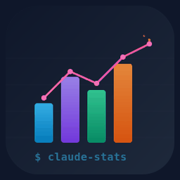

<p align="center">
  
</p>

# claude-stats

Analytics suite for [Claude Code](https://docs.anthropic.com/en/docs/claude-code) — track your token usage, tool patterns, session health, productivity, and more.

All data is read locally from `~/.claude/projects/` session files. Nothing is sent anywhere.

**Color-coded terminal output** — gradient bars, colored heatmaps, semantic scorecards, and trend arrows render beautifully in any 256-color terminal.

## Install

### One-liner (Linux / macOS / WSL)

```bash
curl -fsSL https://raw.githubusercontent.com/Andrevops/claude-stats/main/install.sh | sh
```

### Windows (PowerShell)

```powershell
irm https://raw.githubusercontent.com/Andrevops/claude-stats/main/install.ps1 | iex
```

### Go install

```bash
go install github.com/Andrevops/claude-stats/cmd/claude-stats@latest
```

### Build from source

```bash
git clone https://github.com/Andrevops/claude-stats.git
cd claude-stats
make install
```

### Docker (no install required)

```bash
git clone https://github.com/Andrevops/claude-stats.git
cd claude-stats
make docker-run              # interactive menu
make docker-run-cmd CMD="tokens --week"
```

## Usage

### Interactive menu

```bash
claude-stats
```

### Direct commands

```bash
claude-stats tokens              # today's token usage & cost
claude-stats tokens --week       # last 7 days
claude-stats tools --month       # tool analytics for last 30 days
claude-stats report --all        # all-time executive summary
claude-stats digest --ai         # today's work digest + AI summary
```

### Available commands

#### `tokens` — Token Usage & Cost

Shows input/output/cache token counts and estimated cost, broken down by project and model. Includes a cost breakdown showing where your spend goes (cache reads, output, cache creation).

```bash
claude-stats tokens --week
```

#### `tools` — Tool Call Analytics

Ranks every tool by call count and error rate. Shows workflow balance (read vs write vs agent), Bash subcommand breakdown, common tool chains (e.g., Read -> Edit), and per-project tool usage.

```bash
claude-stats tools --month
```

#### `prompts` — Permission Prompt Analysis

Simulates your `settings.json` allowlist against all tool calls to show which ones required manual approval. Suggests new allow patterns to reduce prompt friction and estimates how many prompts each pattern would save.

```bash
claude-stats prompts --week
```

#### `heatmap` — Activity Heatmap

Color-coded heatmaps (blue→teal→amber→red) showing messages and cost by hour-of-day and day-of-week. Includes hourly/daily summaries with gradient bars, a calendar view of the last 30 days, top sessions by cost, and peak hour detection. Uses your system timezone.

```bash
claude-stats heatmap --month
```

#### `lines` — Lines of Code

Tracks lines written (Write tool), added, and removed (Edit tool). Breaks down by file extension, project, and individual file. Shows net lines, throughput, and identifies your most-touched files.

```bash
claude-stats lines --week
```

#### `sessions` — Session Health

Analyzes individual sessions for context growth, duration vs productivity, and error rates. Flags bloated sessions (>200% context growth) and recommends when to restart. Compares productivity across session length buckets.

```bash
claude-stats sessions --week
```

#### `efficiency` — Productivity Metrics

Measures lines/turn, files/turn, output tokens/turn, and error rate. Classifies turns as productive (Write/Edit), research (Read/Search), or overhead (errors). Per-project efficiency comparison and quota impact estimation.

```bash
claude-stats efficiency --week
```

#### `report` — Executive Summary

Combines all analytics into one compact view: overview, daily activity sparkline, project leaderboard, top tools, session health, peak hours, permission prompts, and a color-coded scorecard (green/yellow/red) with an overall grade.

```bash
claude-stats report --week
```

#### `digest` — Work Digest

Human-readable summary of what you worked on: projects, Jira tickets, branches, MRs created, commits, deploys, AWS commands, and key files changed. Supports `--ai` for a Claude-powered natural language summary with a ready-to-paste standup message (requires the `claude` CLI).

```bash
claude-stats digest --week
claude-stats digest --ai          # includes AI-generated summary
```

#### `trends` — Week-over-Week Comparison

Compares current period against the previous equivalent period. Shows deltas for sessions, messages, cost, lines, errors, efficiency, and per-project breakdowns with colored trend arrows (green ▲ / red ▼).

```bash
claude-stats trends              # this week vs last week (default)
claude-stats trends --month      # this month vs last month
claude-stats trends --yesterday  # yesterday vs day before
```

### JSON output

The `tokens`, `report`, and `trends` commands support `--json` for structured output you can pipe into other tools:

```bash
claude-stats tokens --week --json
claude-stats report --week --json | jq '.cost'
claude-stats trends --month --json
```

### Time filters

All commands accept these options:

```
(default)        Today
--yesterday      Yesterday
--week           Last 7 days
--month          Last 30 days
--all            All time
YYYY-MM-DD       Specific date
```

## Update

```bash
claude-stats update
```

The binary checks GitHub for the latest release, downloads it, and replaces itself atomically.

## Verify release signatures

Each release includes ED25519-signed checksums and GitHub build provenance attestation.

```bash
# Verify build provenance
gh attestation verify claude-stats-linux-amd64 --repo Andrevops/claude-stats

# Verify checksum signature
curl -fsSL https://raw.githubusercontent.com/Andrevops/claude-stats/main/public_key.pem -o public_key.pem
xxd -r -p checksums.txt.sig | openssl pkeyutl -verify -pubin -inkey public_key.pem -rawin -in checksums.txt -sigfile /dev/stdin
```

## Requirements

- Claude Code (the data source — `~/.claude/projects/`)
- `~/.local/bin` on your `$PATH` (default on most Linux/WSL/macOS)

No runtime dependencies — single static binary.

## Andrevops Ecosystem

claude-stats is part of the [Andrevops](https://github.com/Andrevops) developer tooling suite.

| Tool | Relationship |
|------|-------------|
| [claude-sandbox](https://github.com/Andrevops/claude-sandbox) | Sessions launched via claude-sandbox's `yolo` command are stored in `~/.claude/projects/` — exactly what claude-stats reads and analyzes |
| [Diffchestrator](https://github.com/Andrevops/diffchestrator) | Claude Code sessions launched from Diffchestrator's per-repo terminals generate the session data claude-stats reports on |
| [Epic-Lens](https://github.com/Andrevops/Epic-Lens) | Tracks the Jira epics and MRs produced by the sessions claude-stats measures |
| [Makestro](https://github.com/Andrevops/Makestro) | Complementary — run `make` targets from VS Code while claude-stats tracks the Claude sessions alongside |

### Workflow

```
Claude Code session (via Diffchestrator / claude-sandbox)
        │
        ▼
  ~/.claude/projects/   ← session JSONL files
        │
        ▼
  claude-stats tokens / tools / efficiency / report
```

## Collaboration

### [@AgusRdz](https://github.com/AgusRdz)

Rewrote claude-stats from Python to Go — porting all 10 analytics commands into a single static binary with cross-platform install scripts, CI/CD for 6 platform targets, and Docker support. Fixed several Python-era bugs including an off-by-one in sessions, double-width emoji display issues, and Windows binary-locking during self-updates.

## License

MIT
